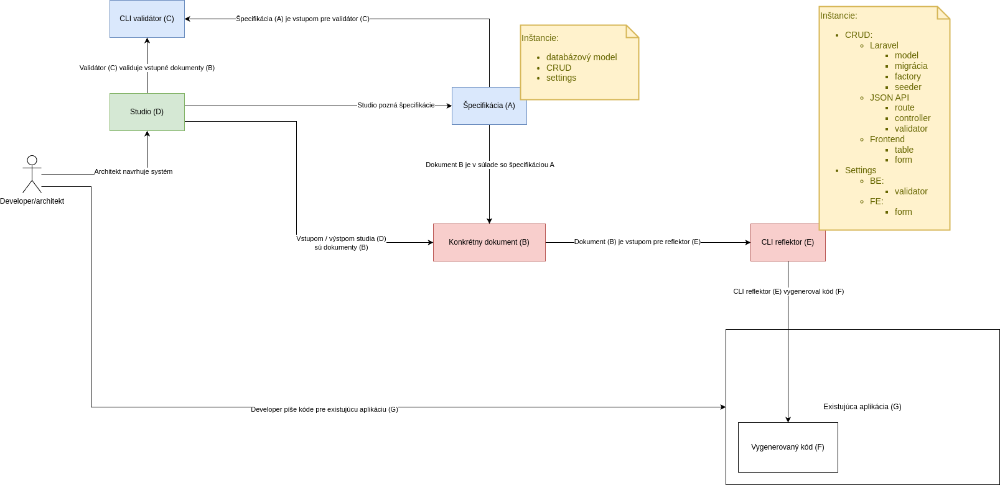

# Prehľad systému

Tento dokument popisuje filozofiu systému a jeho hlavné časti.



https://app.diagrams.net/#G1m-tZzdKh5uSyIV_dX-fXz8gjNjgfzdg1#%7B%22pageId%22%3A%22PjuKkPxdwxgHZ1NxEY6J%22%7D

## Kľúčové pojmy

### 1. Špecifikácia (A)
Špecifikácia definuje pravidlá pre štruktúru dát. Môže byť:
- **Slovná** – textový popis požiadaviek
- **Technická** – napr. JSON Schema, ktorá určuje formát dát

#### Príklady špecifikácií:
- Definícia databázového modelu
- Štruktúra nastavení aplikácie
- Opis CRUD používateľského rozhrania

### 2. Konkrétny dokument (B)
Tento dokument je vytvorený podľa špecifikácie a obsahuje údaje pre konkrétnu aplikáciu.

#### Príklady konkrétnych dokumentov:
- Súbor s databázovým modelom aplikácie XYZ (`xyz_database.json`)
- Súbor s nastaveniami aplikácie XYZ (`xyz_settings.json`)

### 3. CLI validátor (C)
Nástroj, ktorý overuje, či konkrétny dokument spĺňa špecifikáciu. Môže to byť skript (`.sh`, `.js` atď.), ktorý sa spúšťa cez terminál.

#### Použitie:
```sh
validate.sh xyz_database.json
```
Ak dokument nie je validný, nástroj vypíše chyby.

### 4. Studio (D)
Desktopová aplikácia na tvorbu a úpravu konkrétnych dokumentov (B). Používa sa ako vizuálny editor na "naklikanie" rôznych štruktúr.

#### Možnosti Studio aplikácie:
- Vizuálna tvorba databázového modelu
- Správa konfiguračných súborov
- Návrh CRUD rozhraní

### 5. CLI reflektor (E)
Nástroj na automatické generovanie kódu. Ako vstup používa konkrétny dokument (B) a na výstupe produkuje vygenerovaný kód (F).

#### Použitie:
```sh
reflector.sh xyz_database.json
```

### 6. Vygenerovaný kód (F)
Zdrojový kód, ktorý vytvoril reflektor. Programátor ho nepísal manuálne, ale vznikol na základe konkrétneho dokumentu (B).

#### Príklady vygenerovaného kódu:
- Triedy v PHP/Laravel na základe databázového modelu
- Konfiguračné súbory pre aplikáciu
- Vue komponenty pre CRUD rozhranie

### 7. Existujúca aplikácia (G)
Zdrojový kód nejakej už existujúcej aplikácie, napr. Laravel projekt. Tento kód je pod správou reálneho developera. **Vygenerovaný kód (F)** sa môže pomocou **CLI reflektora (E)** generovať priamo dovnútra takejto aplikácie. Treba ale mať na mysli to, že ak následne developer upraví **Vygenerovaný kód (F)** a následne sa znova spustí **CLI reflektor (E)** tak zmeny v kóde, ktoré spravil developer sa stratia!
